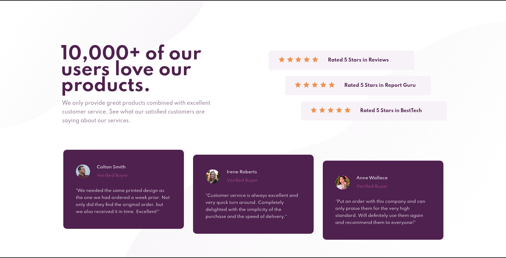

# Frontend Mentor - Social proof section solution

This is a solution to the [Social proof section challenge on Frontend Mentor](https://www.frontendmentor.io/challenges/social-proof-section-6e0qTv_bA). Frontend Mentor challenges help you improve your coding skills by building realistic projects.

## Table of contents

- [Overview](#overview)
  - [The challenge](#the-challenge)
  - [Screenshot](#screenshot)
  - [Links](#links)
- [My process](#my-process)
  - [Built with](#built-with)
  - [Biggest challenges](#biggest-challenges)
  - [Continued development](#continued-development)
  - [Useful resources](#useful-resources)
- [Author](#author)

## Overview

### The challenge

Users should be able to:

- View the optimal layout for the section depending on their device's screen size.

### Screenshot

### Links

- [Solution URL](https://aguscorvo.github.io/social-proof-section/)

## My process

### Built with

- Semantic HTML5 markup
- CSS custom properties
- Flexbox
- Mobile-first workflow
- Sass

### Biggest challenges

The desktop view was really challenging. Also, positioning the background images.

### Continued development

On my next projects I'll focus on practicing Grid Layout.

### Useful resources

- [Platzi](https://platzi.com)
- [freeCodeCamp](https://www.freecodecamp.org)
- [MDN Web Docs](https://developer.mozilla.org/en-US/docs/Web/CSS)

## Author

- Frontend Mentor - [@aguscorvo](https://www.frontendmentor.io/profile/aguscorvo)
- Twitter - [@agustina_corvo](https://twitter.com/agustina_corvo)
